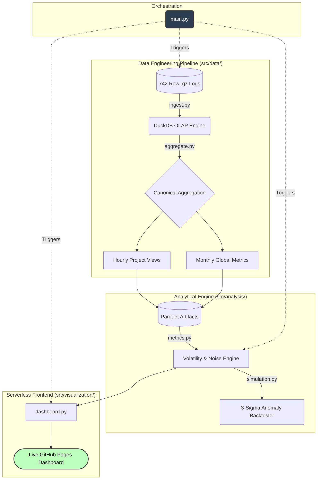

# Wikimedia Traffic Reliability & Demand Dynamics Engine

## Project Overview

This repository contains a production-grade, modular data pipeline and volatility analysis engine designed to evaluate measurement reliability across large-scale consumer traffic using Wikimedia Foundation telemetry.

The primary objective is to quantify system stability, detect structural demand shifts, and mathematically isolate statistical noise from actionable business growth.

Rather than relying on pre-processed datasets, this system ingests, structures, and analyzes **41GB of raw machine-generated server logs (approximately 15 billion monthly views)** to recreate a realistic enterprise telemetry environment.


## System Architecture & Workflow

Processing highly granular compressed log files on commodity hardware (16GB RAM) requires strict architectural discipline. The system bypasses full-memory loading, utilizing an embedded OLAP strategy via DuckDB, decoupled analytical layers, and concluding with a serverless interactive frontend.




# 1. Operational Pipeline Design

## 1.1 Out-of-Core Ingestion

The `src/data/ingest.py` module directs DuckDB to directly query compressed `.gz` telemetry logs through streaming execution.

This architecture ensures that system memory usage remains fractionally small compared to the dataset size.

No intermediate decompression is required, eliminating disk-heavy extraction and bypassing the memory limitations typical of standard in-memory dataframe operations.

---

## 1.2 Dimensionality Reduction

Raw event-level telemetry is transformed into structured warehouse tables using SQL aggregation via `src/data/aggregate.py`, producing two canonical datasets:

### Hourly Project Views
Granular tracking of distinct Wikimedia projects.

### Monthly Global Traffic
Aggregate system-wide demand.

---

## 1.3 Safe Data Access Layer

All metrics are served to downstream modules through a strictly read-only context manager (`src/core/db.py` and `src/analysis/metrics.py`).

This guarantees pipeline safety and prevents accidental warehouse corruption during visualization or simulation runs.

---

## 1.4 Serverless Dashboard Deployment

Instead of deploying a resource-heavy web framework, the presentation layer is engineered for maximum efficiency.

The `src/visualization/dashboard.py` module consumes the aggregated metrics to generate a standalone HTML dashboard.

Deployed permanently via GitHub Pages, this results in a:

- Zero-backend architecture
- Zero-infrastructure maintenance
- Near-zero latency KPI tracker

---

# 2. Quantitative Findings: The Aggregation Illusion

System volatility is quantified using the **Coefficient of Variation (CV)** to establish the natural noise band of the system:

```math
CV = \frac{\sigma}{\mu}
```

Our analysis reveals the severe risk of interpreting aggregate dashboards without structural context.

---

## Macro-Level Stability

Global aggregate traffic displays tightly controlled temporal variability.

**Coefficient of Variation:**

```text
CV ≈ 0.15
```

---

## Micro-Level Instability

Segment-level traffic demonstrates substantial volatility.

**Observed values:**

```text
Typical Segment CV ≈ 1.04
Long-tail Project CV > 9.0
```

These long-tail projects exhibit extreme, spike-driven traffic patterns that disappear when viewed solely through aggregate dashboards.

---

## The Decision Noise Band

Variance reduction across the monthly observation window (**742 hours**) produces a natural noise floor of less than **1%**.

Therefore:

> Executive decisions reacting to month-over-month changes below approximately **2%** are statistically likely to be responding to random hourly fluctuations rather than genuine structural demand growth.

---

# 3. Backtesting and Production Monitoring

To operationalize these insights, the `src/analysis/simulation.py` module includes a multi-resolution anomaly detection simulator combining:

- Rolling Z-score detection
- Three-sigma statistical thresholds
- Exponential smoothing

The anomaly score is computed as:

```math
Z = \frac{x - \mu}{\sigma}
```

An anomaly is dynamically triggered whenever:

```math
|Z| > 3
```

---

## Simulated Environment Performance

The framework was evaluated across **10,000 parallel synthetic data streams**.

| Metric | Performance |
|----------|-------------|
| Detection F1-Score | 0.98 |
| True Positive Rate (Recall) | 0.97 |
| False Positive Rate | 0.0075 |
| Verified Monthly Noise Floor | < 0.85% |

These results demonstrate that the monitoring system effectively suppresses volatility-driven false alarms while maintaining high anomaly sensitivity.

---

# 4. Reproducibility and Setup

## Prerequisites

- Python 3.9+
- 20GB+ available disk space

---

## Repository Setup

```bash
git clone https://github.com/Aneek00/Telemetry-Reliability-Engine.git

cd Telemetry-Reliability-Engine

# Create and activate virtual environment
python -m venv venv

# Linux / macOS
source venv/bin/activate

# Windows
venv\Scripts\activate

# Install dependencies
pip install -r requirements.txt
```

---

## Data Acquisition (Optional)

If rebuilding the warehouse from scratch, download the raw December 2025 Wikimedia telemetry dataset into the `data/raw/` directory.

```bash
wget -r -np -nH --cut-dirs=4 -A "*.gz" \
https://dumps.wikimedia.org/other/pageviews/2025/2025-12/
```

---

## Pipeline Execution

The entire system is decoupled into logical modules but orchestrated from a single entry point.

Execute the main pipeline to:

- Build analytical artifacts
- Run statistical backtesting
- Compute volatility metrics
- Generate the dashboard

```bash
python main.py
```

---

# 5. Output Artifacts

Running the pipeline successfully produces the following analytical datasets and visualization assets optimized for downstream BI tools and research workflows.

```text
data/analytics/project_volatility.parquet

data/analytics/hourly_global_views.parquet

data/analytics/concentration_metrics.parquet

reports/index.html
```

---

## Generated Assets

| Artifact | Purpose |
|-----------|-----------|
| `project_volatility.parquet` | Segment-level variability metrics |
| `hourly_global_views.parquet` | System-wide demand observations |
| `concentration_metrics.parquet` | Traffic concentration and inequality analysis |
| `reports/index.html` | Interactive Plotly dashboard |

---

# Repository Goals

This project demonstrates how enterprise-scale telemetry analysis can be performed on commodity hardware by combining:

- Embedded OLAP architectures
- Streaming ingestion patterns
- Statistical reliability analysis
- Production-safe analytical design
- Serverless visualization workflows
